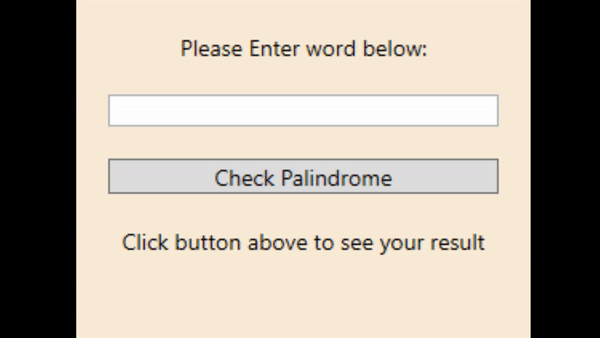

# Palindrome Checker

A simple Palindrome Checker application developed using C#, .NET Framework 4.8 and .NET Standard 2.0 Class Libaries. The project includes three user interfaces including Console, Windows Presentation Foundation (WPF) and Universal Windows Platform (UWP). This application was created to improve my experience with both WPF and Universal Windows Platform development.

_GIF above shows the Windows Presentation Foundation (WPF) version of the application._

## Project Requirements:

* Visual Studio 2019 & .NET Framework 4.8
* For the Universal Windows Platform (UWP) application, the following Windows 10 Software Development Kits (SDK) are required:

  **Target SDK Version:**

  * **Windows 10 SDK (10.0.18362.1)** - Released in conjunction with Windows 10, version 1903.
  
  **Min SDK Version:**

  * **Windows 10 SDK (10.0.16299.91)** - Released in conjunction with the Windows 10 Fall Creators Update (version 1709).

## How to Install:

**Please note this application can only be run on Windows 10.**

1. Clone this repository or Download and Extract project's zip file.
2. Open `PalindromeChecker.sln` using Visual Studio 2019.
3. The project should start loading, _(you may be prompted to install required SDKs and dependencies for the UWP version of the application)_.

## How to Run:

  
Console

1. Expand `UserInterface` folder.
2. Right click on `PalindromeChecker.UI.Console` and click `Set as StartUp Project`.
3. Press `Start` (Green Triangle at top of screen) and the application should load.
   

  
Windows Presentation Foundation (WPF)

  1. Expand `UserInterface` folder.
  2. Right click on `PalindromeChecker.UI.WPF` and click `Set as StartUp Project`.
  3. Press `Start` (Green Triangle at top of screen) and the application should load.

  
Universal Windows Application (UWP)

  
  1. Expand `UserInterface` folder.
  2. Right click on `PalindromeChecker.UserInterface.UWP` and click `Set as StartUp Project`.
  3. Press `Start` (Green Triangle at top of screen) and the application should load.

